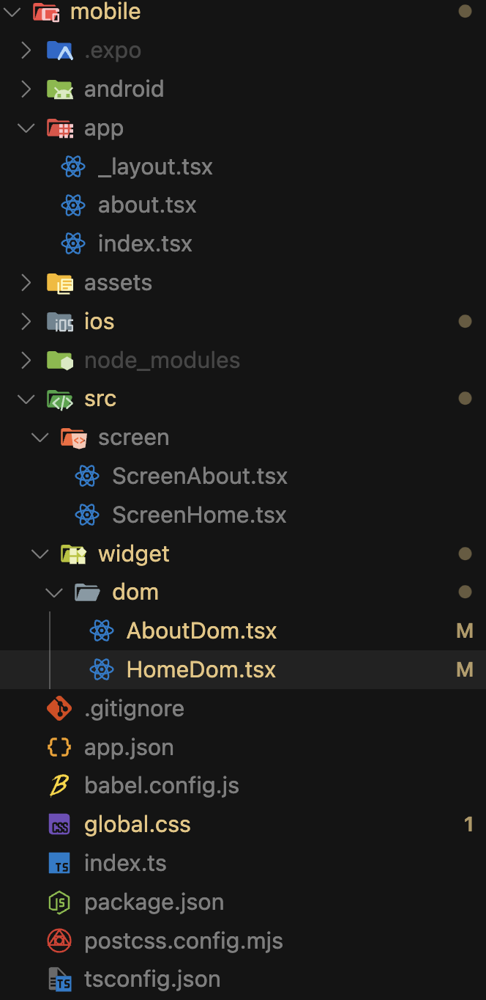
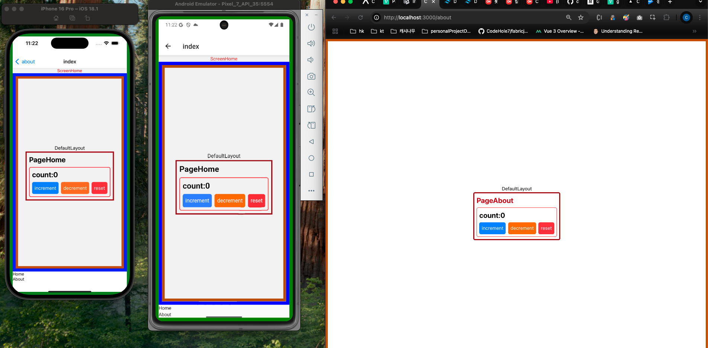

# [App] Expo NextJS monorepo 구성


# 기본 세팅

- pnpm workspace (monorepo)
- nextjs, expo prebuild, tailwindcss v4 구성
- expo ‘use Dom’ 구성

# Setting STEPS

- pnpm-workspace.yaml setting

  ```java
  packages:
    - packages/*

  nodeLinker: isolated # important
  ```

- nextjs package.json   
  you have to make nextjs’s react, and react-dom to be same version that is used in expo  
  nextjs 와 expo 의 react, react-dom 버전이 같아야함

  ```java
  "dependencies": {
      "react": "19.0.0",
      "react-dom": "19.0.0",
    ...
  ```
- expo package.json  
  tailwind, some of the need dependencies like below  
  아래에 나온것처럼 필요한 라이브러리 설치 해야함

  ```java
  "dependencies": {
      "@expo/metro-runtime": "~5.0.4",
      "@next-expo-example/web": "workspace:*",
      "@tailwindcss/postcss": "^4.1.11",
      "expo": "~53.0.15",
      "expo-constants": "~17.1.6",
      "expo-linking": "~7.1.6",
      "expo-router": "~5.1.2",
      "expo-status-bar": "~2.2.3",
      "expo-system-ui": "~5.0.9",
      "postcss": "^8.5.6",
      "react": "19.0.0",
      "react-dom": "19.0.0",
      "react-native": "0.79.4",
      "react-native-safe-area-context": "5.4.0",
      "react-native-screens": "~4.11.1",
      "react-native-web": "^0.20.0",
      "react-native-webview": "13.13.5",
      "tailwindcss": "^4.1.11"
      ...
    },
  ```
- add Tailwind global.css to Expo repo  
  tailwind 넣기

  

  and in global.css

  ```css
  @import "tailwindcss";

  @source "./node_modules/@next-expo-example"; 
  /* important 
  making to apply in the monorepo repository
  */

  ```
- Dom Component in Expo repo

  ```java
  "use dom";
  import React from "react";

  import PageHome from "@next-expo-example/web/src/page/PageHome";
  import "../../../global.css";

  export default function HomeDom({}: { dom: import("expo/dom").DOMProps }) {
    return (
      <div className='flex-1'>
        <PageHome />
      </div>
    );
  }

  /**
   *  have to follow above structure,
   *  1. always import global.css
   *  2. always use export default function HomeDom and pass dom props
   *  3. "use dom" is required
   *  4. <div className='flex-1'> it does not matter either dom or native component,
      but have to make flex-1 or something that takes up full height and width  
  */

  ```

# Pitfall

- cannot use turbo in Nextjs for dev  
  nextjs 터보 모드 쓸수없음
- cannot use tailwindcss in expo aside from “dom”   
  dom component 외에 테일윈드 쓰기 불가, nativewind 쓰면 conflict 날듯

  - tailwind is not applicable for native component like View, Text and etc,   
    네이티브 컴포넌트에서 못씀
- in nextjs , react , react-dom is fixed on v 19( assumable following the version of expo inner react version)  
  넥스트내부 react, react-dom 을 expo 에 맞추어야함



